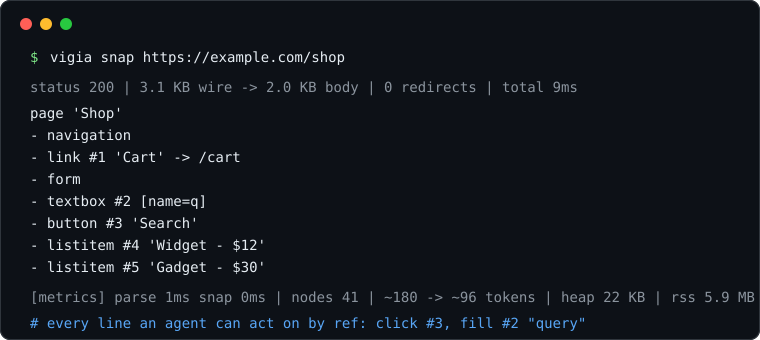

<p align="center">
  
</p>
<h1 align="center">vigia</h1>
<p align="center">
<strong>The agent-native browser, written from scratch in Rust.</strong><br>
No Chromium. No WebKit. No borrowed engine. No render pipeline.<br>
Fetches, parses, runs the page's own JavaScript, and hands agents a
semantic snapshot they can act on by <code>#ref</code>.
</p>

<div align="center">

[](https://github.com/matthew7990/vigia/blob/master/LICENSE)
[](https://github.com/matthew7990/vigia/actions/workflows/ci.yml)
[](https://github.com/matthew7990/vigia/stargazers)

</div>

<div align="center">
  
</div>

Two numbers the whole design answers to: **tokens per observed page**
and **bytes of RAM per session**. vigia is ~40-90x faster and ~2.3x
lighter than [lightpanda](https://github.com/lightpanda-io/browser) on
our benchmark corpus, while emitting action refs and link targets a
text dump doesn't carry. Details below.

## Why from scratch

Every "browser for AI" embeds Chromium: roughly 300 MB before the first
request, a render pipeline scraping never uses, and a resource ceiling
you do not control. vigia's premise:

- **No layout, no paint, no compositor.** Agents read the DOM, not
  pixels. Skipping render removes most of a browser's memory cost.
- **Own HTTP/1.1, own URL parser, own inflate, own HTML parser, own
  arena DOM, own CSS engine, own JavaScript interpreter.** The load is
  measurable per crate. `vigia-mem` counts every allocation.
- **Sessions without a browser.** An RFC 6265 cookie jar persists auth
  across runs. `--tab` runs the same script in parallel sessions.
- **JavaScript is a bounded module.** `vigia-js` is our own interpreter:
  arena values behind a hard cap, mark-sweep GC, promises and timers on
  a deterministic virtual clock. It never owns a render loop.

Scope honesty: a full-spec web engine is a Servo-scale project. vigia's
scope is what agents need: fetch, parse, DOM, extract, act, record.

## Install

Download a release binary:

```console
curl -L -o vigia https://github.com/matthew7990/vigia/releases/latest/download/vigia-x86_64-linux
chmod a+x ./vigia
```

Or build from source (Rust stable, no other deps):

```console
cargo build --release
./target/release/vigia snap https://example.com
```

## Quick start

```console
vigia snap <url>                  # semantic snapshot with #n action refs
vigia fetch <url>                 # raw response body
vigia extract <url> "td.price"    # CSS selector extraction
vigia click <url> 3               # follow snapshot ref #3 (gets a new page)
vigia submit <url> -d user=x -d pass=y   # form login
vigia req <url> -H 'K: V' -d '{..}'   # raw API call on the session jar
vigia json <url> [a.b.0]          # embedded JSON (__NEXT_DATA__, ld+json)
vigia js <file.js> | -e "<code>"  # run JavaScript (own interpreter)
vigia run <file.vig> [--audit log.jsonl] # multi-step script + audit trail

vigia --js snap <url>             # run the page's own <script>s first
vigia snap <url> --profile work   # persistent cookies on disk

# the same script in parallel tabs - one profile jar per tab:
vigia run login.vig --tab alice --tab bob \
  -D alice.USER=alice -D alice.PASS=x -D bob.USER=bob -D bob.PASS=y

vigia serve [--bind 127.0.0.1:8080]  # HTTP + MCP session API for agents
```

A `.vig` script is one op per line, executed in a single process with a
shared session:

```
# login.vig
snap https://example.com/login
fill #1 myuser
fill #2 "my password"
click #3
expect "Dashboard"
extract li.item
net    # every fetch() the page's JS fired (endpoint discovery)
req https://api.example.com/data -H "Content-Type: application/json" -d "{\"a\":1}"
```

Every command reports cost and latency on stderr:

```
status 200 | 341 B wire -> 236 B body | connect 0ms tls 0ms ttfb 1ms total 1ms
[metrics] parse 0ms snap 0ms | nodes 20 | ~59 -> ~70 tokens | heap peak 7.9 KB | rss peak 2.6 MB
```

## Benchmark vs lightpanda

The comparison target is [lightpanda](https://github.com/lightpanda-io/browser),
the only other browser for agents built without a borrowed engine.
`bench/` generates a deterministic corpus and measures wall time, peak
RSS (wait4), and the size of the agent-facing dump (`vigia snap` vs
`lightpanda fetch --dump semantic_tree_text`).

| Page | Tool | ms | RSS MB | out B | ~tokens |
|---|---|---:|---:|---:|---:|
| article | **vigia** | **5.3** | **9.6** | **54,815** | **13,703** |
| article | lightpanda | 325.4 | 22.2 | 232,208 | 58,052 |
| small | **vigia** | **3.2** | **9.6** | 172 | 43 |
| small | lightpanda | 295.4 | 21.8 | **152** | **38** |
| table | **vigia** | **10.5** | **9.6** | 142,537 | 35,634 |
| table | lightpanda | 452.0 | 26.3 | **100,008** | **25,002** |

- **Speed.** vigia is ~40-90x faster. Lightpanda boots a JS runtime per
  page; vigia's is a flat arena that is already warm.
- **Memory.** ~2.3x less RSS (9.6 MB vs ~22 MB).
- **Tokens.** vigia wins on content-heavy pages (4x smaller on article).
  On link/table-heavy pages lightpanda is smaller precisely because it
  drops link targets, which then cost a second CDP call to navigate.
  vigia emits `-> href` and `#n` refs inline so the agent can act
  directly.

Reproduce: `make bench` (expects the lightpanda binary at
`bench/bin/lightpanda`), or `python3 -m http.server 8899 -d bench/corpus &`
then `python3 bench/run.py`.

## Crates

| Crate | Responsibility |
|---|---|
| `vigia-net` | HTTP/1.1 on `std::net`: chunked, redirects, gzip. 8 MiB wire cap, per-phase timings |
| `vigia-url` | URL parser and relative resolution: dot-segments, percent-encoding |
| `vigia-inflate` | DEFLATE/zlib/gzip decoder (RFC 1950-1952), output cap against zip bombs |
| `vigia-tls` | TLS boundary. Opaque `TlsStream`, the one declared exception (rustls) |
| `vigia-html` | Tokenizer and tree builder, one streaming pass, no event buffer |
| `vigia-dom` | Arena DOM: flat `Vec<Node>`, interned strings, `u32` ids |
| `vigia-charset` | Bytes -> UTF-8: BOM, Content-Type, meta sniff (win-1252, utf-16) |
| `vigia-css` | Selector engine: tag, .class, #id, [attr ops], pseudos, combinators, groups |
| `vigia-session` | Cookie jar and persistent profiles (RFC 6265 host-only/domain rules) |
| `vigia-actions` | Forms, submit, click, fill: actions resolved by snapshot ref |
| `vigia-snapshot` | DOM -> semantic tree for agents: roles, inline names, `#n` refs |
| `vigia-json` | JSON parser/serializer, order-preserving values, dotted-path lookup |
| `vigia-js` | JS interpreter: lexer, parser, tree-walk eval, prototypes, async, mark-sweep GC. Beyond ES5: `?.` `??` arrows `for-of/in` regex+RegExp templates spread/rest defaults destructuring `switch` `do-while` `void` methods/getters/setters Symbol Map/Set/WeakMap. No classes yet |
| `vigia-run` | `.vig` script runner: sequential ops, shared session, parallel tabs, JSONL audit |
| `vigia-mem` | Counting allocator and RSS peak: the total-load meter |
| `vigia` (cli) | All commands above. Metrics on stderr, always |

## Dependency policy

Everything is ours. The standard library and the OS (sockets, system
DNS) are the floor. Third-party crates are the exception: declared,
isolated, temporary.

One exception today, behind `crates/tls`: rustls + ring + webpki-roots.
Homegrown crypto holding real credentials is the classic way to leak
them. Own TLS 1.3 (X25519, AES-GCM, SHA-256, cert validation) replaces
it, differential-tested against rustls as reference.

## Status

Done:

- Own HTTP/1.1, URL parser, inflate, TLS boundary
- Semantic snapshot: roles, inlined names, `#n` interactive refs, collapsed wrappers
- Benchmark harness vs lightpanda (`bench/`)
- Entities (named, numeric, C1 -> win-1252) and charset decoding
- Own CSS selector engine; forms (GET/POST, hidden fields, redirects)
- Actions by ref (`click`/`fill`/`submit`); persistent profiles; parallel tabs
- Embedded-JSON extraction (`__NEXT_DATA__`, `ld+json`)
- `vigia-js`: own lexer/parser/eval, prototypes, builtin methods,
  `new`/`instanceof`/`in`, DOM bindings (`getElementById`,
  `querySelector(All)`, `createElement/TextNode`, `appendChild`,
  `insertBefore`, `remove`, live `style` block, `outerHTML`),
  events with bubbling, external `src=` scripts, Promise + microtasks +
  virtual-clock timers + `async`/`await`, Promise-returning `fetch`,
  mark-sweep GC
- `vigia-js` language coverage beyond ES5: `?.` `??` arrows `for-of/in`
  regex literals + `RegExp` (`test`/`exec`/`match`/`replace`/`split`/
  `search`) template literals (untagged) spread/rest params comma
  operator default params destructuring `switch` `do-while` `void`
  method/get/set shorthand `Symbol` `Map`/`Set`/`WeakMap`
  `Object.freeze`/`defineProperty` `self`/`globalThis`
- Replay: `.vig` scripts plus JSONL audit trail
- `vigia serve`: HTTP session API + MCP `tools/call` surface (one
  worker thread per session, JSON in/out)

Next:

- JS: classes (`extends`/`super`), logical assignment, `**`, `delete`
- Own TLS 1.3 (replace the rustls exception)
- HTML5 tree-construction hardening (adoption agency, foster parenting)
- Keep-alive pooling; parallel fetch engine (thread pool, RSS budget)
- WebForms postbacks (`__doPostBack`, `form.submit()`); no UpdatePanel/AJAX yet

Honest limits: pending `await` is unsupported (vigia settles eagerly);
no capture phase on events; `Connection: close` per request today.
No stealth / anti-bot evasion: a bot-manager CAPTCHA is a wall, not a
puzzle — the strategy is valid sessions plus API replay (`net` + `req`),
not fingerprint spoofing.

## Docs and contributing

- `docs/architecture.md`: the load thesis, what is deliberately missing, the risk register.
- `AGENTS.md`: build/test commands and contribution conventions.
- `CONTRIBUTING.md`: how to propose changes.
- `SECURITY.md`: reporting vulnerabilities.

## License

MIT
